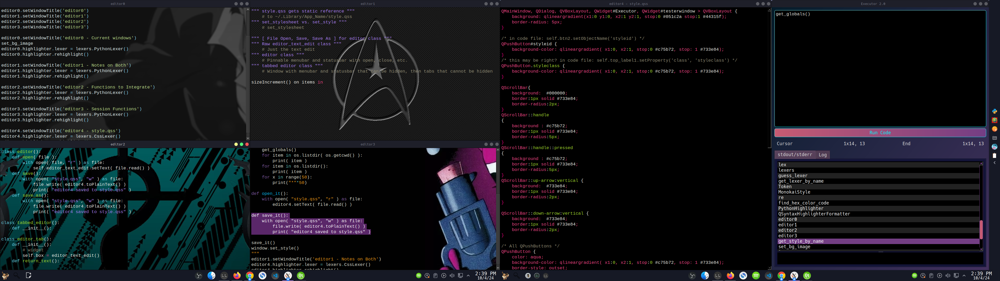
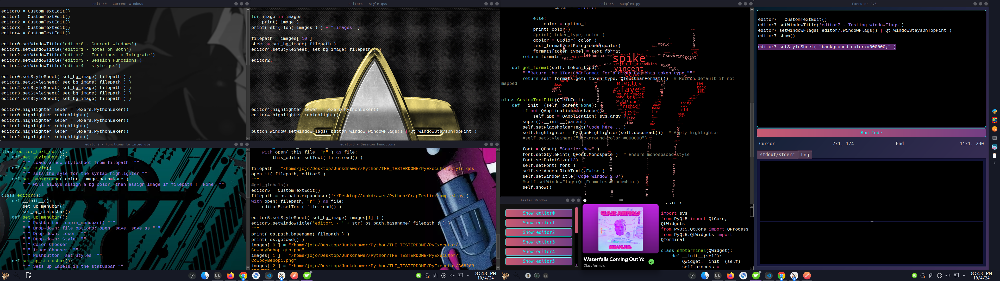

# PyExecutor
- Overly hackable testing interface.   

Executor window meant to be used like an extension for Python Console, but it gives you a little more elbow room than one line at a time.
Its meant to be flexible, to the point you can break it if you choose.  
Written in Python, using Qt. 

The primary reason I made this is that I didn't want to use too many calls to APIs or feeds just because of testing, when I could keep the retrieved info in memory and keep working with it easily without it being one line at a time from the console.  


## Running 
you can run it by running your normal python command with the filepath (`py Executor.py`/`python3 Executor.py`), or you can just import it to an active python console in your terminal:
```
$> python3
# ... # opening text
>>> from Executor import Executor
>>> window = Executor()
```

You can alter its appearance:


All the windows are from this project, except spotify.


*More screenshots in the img directory, and an Additional.md for more detail. 

### Compatibility with other versions of Qt
Interface written in only python, except Qt resources.
Have used with PyQt5/6 and PySide6.  Generally you can swap PyQt5/PySide6, but will have to move QAction's import text from QtWidgets to QtGui, then it should run.  

